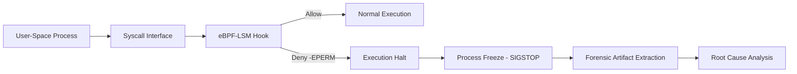

# 🛡️ Lyncis-EDR
### *Kernel-Native Endpoint Detection & Response via eBPF-LSM*

[](https://www.gnu.org/licenses/old-licenses/gpl-2.0.en.html)
[](https://kernel.org)
[](https://ebpf.io/)
[]()

---

## 📌 Overview

**Lyncis-EDR** is a high-performance, **kernel-native Endpoint Detection and Response (EDR)** system designed to enforce **deterministic security policies at the Linux kernel boundary**.

By leveraging **eBPF-LSM (Linux Security Modules)**, Lyncis-EDR provides **synchronous, pre-execution prevention** against memory-based exploits and unauthorized process execution—eliminating the detection gap commonly found in user-space–dependent security solutions.

The system is engineered for **technical users**, including system administrators, SOC analysts, and security researchers, who require **predictable enforcement, low overhead, and forensic integrity**.

---

## 📑 Project Justification & User-Centered Design (UCD)

Lyncis-EDR is developed in alignment with **IMK / HCI (Human–Computer Interaction)** principles to ensure that advanced kernel security mechanisms remain **usable, auditable, and cognitively efficient**.

### Problem-Based Background
Legacy EDR systems predominantly rely on **user-space logging and delayed behavioral analysis**, creating a critical **execution window** where malicious payloads can run before alerts are generated.

This detection gap increases:
- Breach impact
- Analyst workload
- Risk of human error during manual triage

### Target Users
- **System Administrators**  
  Require deterministic enforcement with minimal configuration overhead.
- **Security Analysts (SOC)**  
  Need precise root-cause visibility without alert fatigue.
- **Security Researchers**  
  Require deep kernel telemetry and raw forensic artifacts.

### Business Impact
Lyncis-EDR improves **operational efficiency** by:
- Automating exploit containment
- Reducing manual investigation time
- Protecting critical digital assets from pre-execution compromise

---

## 🚀 Key Technical Features

### 1. LSM-Based Kernel Enforcement
- Hooks directly into the Linux Security Module (LSM) interface
- Implemented using `BPF_PROG_TYPE_LSM`
- Returns `-EPERM` on unauthorized syscalls, including:
  - `mprotect`
  - `execve`
  - `ptrace`

**Result:**  
Hardware-speed prevention of exploit primitives such as unauthorized `RWX` memory transitions.

---

### 2. Real-Time Process Lineage Reconstruction
- Traverses the kernel `task_struct`
- Extracts:
  - `PID`
  - `PPID`
  - `UID`
- Reconstructs full parent–child execution chains

**Outcome:**  
Analysts can deterministically trace an attack’s origin (e.g., web shell → application process → kernel veto).

---

### 3. Automated Forensic Stasis
Upon detecting a policy violation, Lyncis-EDR executes a controlled **Veto–Freeze–Carve** lifecycle:

- **Veto**  
  The malicious syscall is denied instantly at the kernel boundary.
- **Freeze**  
  The offending process is suspended using `SIGSTOP` to preserve volatile state.
- **Carve**  
  Automated extraction of process memory and artifacts (e.g., via `gcore`) for forensic investigation.

This approach ensures **forensic integrity** while preventing attacker evasion or cleanup.

---

## 🛡️ Threat Model

### Assets Protected
- Kernel memory integrity
- User-space execution flow
- Runtime memory permissions
- Forensic evidence consistency

### Adversary Model

| Attribute | Description |
|--------|------------|
| Access Level | Remote or local (unprivileged) |
| Skill Level | Intermediate to advanced |
| Techniques | Web shells, memory loaders, fileless exploits |
| Objective | Arbitrary code execution, persistence |

### Trust Boundary
- **Boundary:** Linux syscall interface  
- **Enforcement Point:** eBPF-LSM hooks  
- **Failure Mode:** Default deny (`-EPERM`)

---

## 🎯 MITRE ATT&CK Mapping

| Tactic | Technique | ID | Lyncis-EDR Mitigation |
|------|----------|----|----------------------|
| Initial Access | Exploit Public-Facing Application | T1190 | Syscall-level veto |
| Execution | Command & Scripting Interpreter | T1059 | Lineage-aware enforcement |
| Defense Evasion | Fileless Malware | T1027 | RWX transition blocking |
| Privilege Escalation | Exploitation for Privilege Escalation | T1068 | Kernel-native enforcement |
| Persistence | Web Shell | T1505.003 | Process freeze & carving |
| Impact | System Compromise | T1485 | Pre-execution prevention |

> Lyncis-EDR mitigates threats **below the behavioral detection layer**, enforcing controls at the exploit primitive level.

---

## 📊 Usability & Business Metrics

| Metric | Traditional EDR | Lyncis-EDR | Human & Business Value |
|------|----------------|-----------|-----------------------|
| Response Time | Post-execution | Pre-execution | Prevents breach impact |
| User Effort | Manual triage | Automated stasis | Reduced cognitive load |
| Navigation | Log-heavy | Clear status feedback | Simplified task flow |
| Reliability | Bypass-prone | Kernel-native | Operational resilience |

---

## 🏗️ System Architecture & Task Flow



## 🛠️ Deployment & Audit
Prerequisites

Linux Kernel 5.7+

clang

llvm

libbpf-dev

Root privileges

## One-Touch Installation & Audit

# Clone repository
```
git clone https://github.com/SS7ZX/Lyncis-EDR.git
cd Lyncis-EDR

# Run automated audit
# Includes compilation, sensor attachment, and exploit simulation
chmod +x audit.sh
sudo ./audit.sh
```

## 👥 Stakeholder Alignment
Owners / Decision Makers

Reduced breach impact

Improved ROI

Deterministic prevention over detection

System Administrators

Minimal runtime overhead

Simple deployment model

Clear auditability

Security Researchers

Deep kernel telemetry

Automated forensic artifacts

Reproducible exploit analysis

## 🎓 Research Attribution
<p align="center"> <b> SS7ZX </b><br/> <i>Security Engineering & Human-Computer Interaction (HCI) Research</i> </p>
