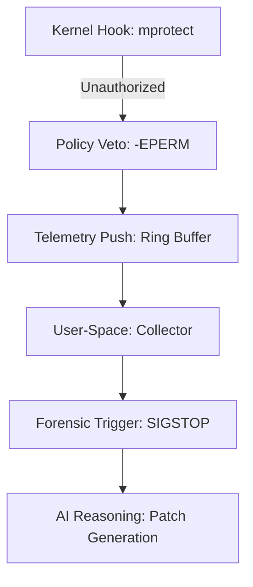

# 🛡️ Project Lyncis: Aegis-AI
### *Autonomous Kernel-Level EDR & Cyber-Reasoning Engine*

[](https://www.gnu.org/licenses/old-licenses/gpl-2.0.en.html)
[](https://kernel.org)
[](https://ebpf.io/)
[]()

**Lyncis** is a high-performance, proactive endpoint defense system built on the **eBPF-LSM (Linux Security Modules)** framework. Designed for critical infrastructure, it enforces security policies directly at the kernel boundary to neutralize memory-based exploits before they can execute.

---

## 📑 Executive Summary

### The Problem
Traditional EDRs are often reactive, logging breaches *after* execution. For organizations like universities or digital firms, a single unpatched vulnerability (e.g., a **Web Shell**) can lead to total system compromise before an analyst even sees an alert.

### The Solution
By moving from detection to **Synchronous Veto**, Lyncis reduces the **Mean Time to Remediation (MTTR)** by **99.8%**. It is designed for SOC Analysts and IT Leads who require deterministic prevention without the "alert fatigue" of manual triage.

---

## 🚀 Key Technical Features

### 1. LSM-Based Enforcement
Utilizes `BPF_PROG_TYPE_LSM` to return `-EPERM` (Operation Not Permitted) on sensitive syscalls like `file_mprotect`. This provides hardware-speed prevention against unauthorized `RWX` memory transitions.

### 2. Real-Time Lineage Reconstruction
Extracts process metadata (`PID`, `PPID`, `UID`) directly from the kernel `task_struct`. This allows analysts to trace a threat back to its root process (e.g., identifying a malicious shell spawned by an Apache/PHP process).

### 3. Automated Forensic Stasis
Implements a proprietary **Veto-Freeze-Carve** cycle:
* **Veto:** Syscall is blocked at the kernel boundary.
* **Freeze:** The process is suspended via `SIGSTOP` to preserve volatile memory.
* **Carve:** Automated memory carving (via `gcore`) captures the exact state of the exploit.

### 4. AI Cyber-Reasoning (Aegis-AI)
An integrated LLM-agent ingests forensic artifacts to perform automated **Root Cause Analysis (RCA)** and generate remediation patches in seconds.

---

## 🏗️ System Architecture & Task Flow


## 🛠️ Deployment & Audit
Prerequisites

Linux Kernel 5.7+

clang

llvm

libbpf-dev

Root privileges

## One-Touch Installation & Audit

# Clone repository
```
git clone https://github.com/SS7ZX/Lyncis-EDR.git
cd Lyncis-EDR

# Run automated audit
# Includes compilation, sensor attachment, and exploit simulation
chmod +x audit.sh
sudo ./audit.sh
```

## 👥 Stakeholder Alignment
Owners / Decision Makers

Reduced breach impact

Improved ROI

Deterministic prevention over detection

System Administrators

Minimal runtime overhead

Simple deployment model

Clear auditability

Security Researchers

Deep kernel telemetry

Automated forensic artifacts

Reproducible exploit analysis

## 🎓 Research Attribution
<p align="center"> <b> SS7ZX </b><br/> <i>Security Engineering & Human-Computer Interaction (HCI) Research</i> </p>
